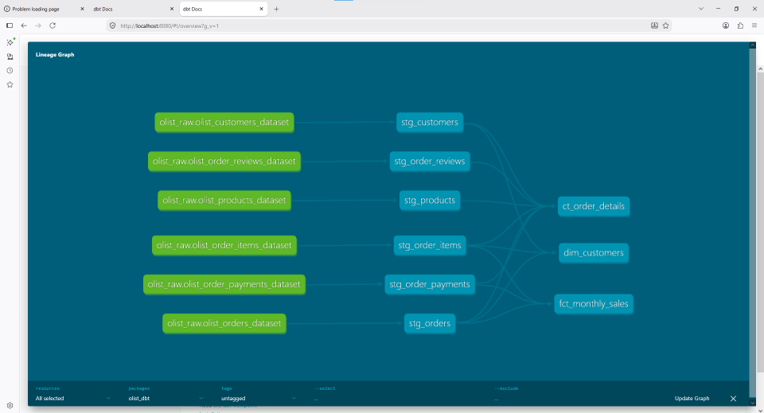
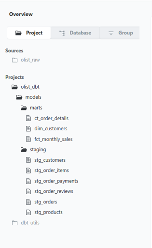
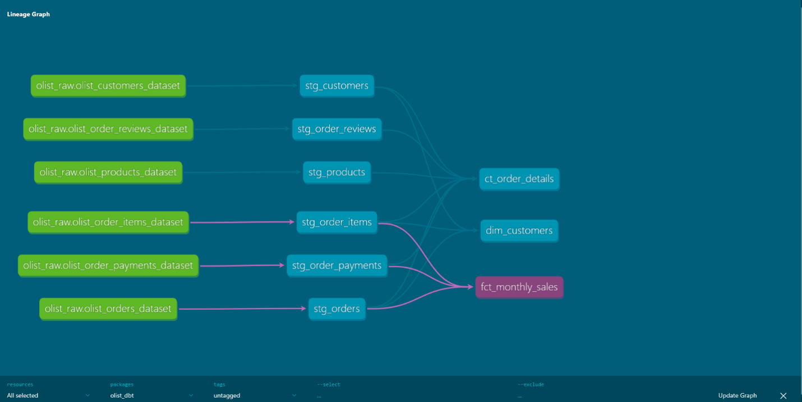

# E-Commerce Analytics Engineering Portfolio

**End-to-end data pipeline for Brazilian E-Commerce analytics using Modern Data Stack**

---

## Table of Contents

- [Overview](#overview)
- [Business Objectives](#business-objectives)
- [Tech Stack](#tech-stack)
- [Architecture](#architecture)
- [Project Structure](#project-structure)
- [Data Models](#data-models)
- [Data Quality](#data-quality)
- [Documentation](#documentation)
- [Installation and Setup](#installation-and-setup)
- [How to Run](#how-to-run)
- [Key Metrics](#key-metrics)
- [Key Learnings](#key-learnings)
- [Dataset Source](#dataset-source)
- [Author](#author)

---

## Overview

This project demonstrates a complete **Analytics Engineering** pipeline for analyzing Brazilian e-commerce data from Olist. The pipeline follows modern data stack best practices, implementing **ELT (Extract-Load-Transform)** architecture with automated data quality testing and comprehensive documentation.

**The project showcases:**
- Data ingestion from CSV files to BigQuery
- Data transformation using dbt with medallion architecture
- Automated data quality testing (24 tests)
- Professional documentation with lineage graphs
- Production-ready code structure

---

## Business Objectives

This analytics pipeline enables business stakeholders to:

1. **Track Sales Performance**: Monitor monthly revenue, order volume, and customer acquisition
2. **Customer Analytics**: Calculate Customer Lifetime Value (CLV) and identify high-value customers
3. **Operational Insights**: Analyze delivery performance and customer satisfaction
4. **Product Analysis**: Identify top-selling categories and products
5. **Data-Driven Decisions**: Provide clean, tested data for BI dashboards and reporting

---

## Tech Stack

| Category | Tool | Purpose |
|----------|------|---------|
| Language | Python 3.8+, SQL | ETL scripting and data transformation |
| Data Warehouse | Google BigQuery | Cloud data warehouse |
| ETL Tool | Python (Pandas) | Extract and Load raw data |
| Transformation | dbt 1.12.4 | Transform data with SQL |
| Package Manager | dbt-utils | Reusable dbt macros and tests |
| Version Control | Git, GitHub | Source code management |
| IDE | VS Code | Development environment |

---

## Architecture

### Data Pipeline Flow

1. **Kaggle CSV Files** (8 datasets)
2. **Python (Pandas)** - Extract and Load
3. **BigQuery Raw** - olist_raw (Bronze Layer)
4. **dbt** - Transform
5. **BigQuery Marts** - olist_dataset (Silver and Gold)

### Medallion Architecture

**Bronze Layer (Raw)**
- Original CSV data loaded as-is
- No transformations or cleaning
- Preserves source data integrity

**Silver Layer (Staging)**
- Data cleaning and standardization
- Column renaming (snake_case)
- Type casting (timestamps, integers, numerics)
- Basic data quality checks

**Gold Layer (Marts)**
- Business logic implementation
- Multi-table JOINs
- Aggregations and metrics calculation
- Ready for BI/Analytics consumption

---

## Data Models

### Staging Layer (Silver)

| Model | Source Table | Description | Transformations |
|-------|--------------|-------------|-----------------|
| stg_orders | olist_orders_dataset | Cleaned order transactions | Type casting, status standardization, timestamp conversion |
| stg_customers | olist_customers_dataset | Customer dimension | City/state normalization, zip code cleaning |
| stg_order_items | olist_order_items_dataset | Order line items | Price calculations, shipping date casting |
| stg_products | olist_products_dataset | Product catalog | Dimension casting, category naming |
| stg_order_payments | olist_order_payments_dataset | Payment transactions | Payment value aggregation, installment tracking |
| stg_order_reviews | olist_order_reviews_dataset | Customer feedback | Review score validation, timestamp handling |

### Marts Layer (Gold)

#### fct_monthly_sales - Monthly Sales Metrics

**Purpose:** Aggregated monthly performance metrics for executive dashboards

**Key Metrics:**
- `total_orders`: Count of delivered orders
- `unique_customers`: Count of unique customers
- `total_revenue`: Sum of order values (price + freight)
- `avg_order_value`: Average revenue per order
- `total_payments`: Sum of payment values

**Business Logic:**
- Filter: WHERE order_status = 'delivered'
- Group: GROUP BY date_trunc(purchased_at, month)

#### dim_customers - Customer Dimension with CLV

**Purpose:** Customer analytics and segmentation

**Key Metrics:**
- `total_orders`: Total orders per customer
- `total_spent`: Customer Lifetime Value (CLV)
- `avg_order_value`: Average spend per order
- `first_purchase_date`: Customer acquisition date
- `last_purchase_date`: Most recent purchase
- `customer_lifetime_days`: Days between first and last purchase

**Use Cases:**
- Identify high-value customers (VIP segmentation)
- Calculate customer retention rates
- Analyze purchase frequency

#### fct_order_details - Granular Transaction Details

**Purpose:** Detailed transaction-level data for deep-dive analysis

**Includes:**
- Order information (status, timestamps, delivery dates)
- Customer details (city, state)
- Product information (category, price, freight)
- Payment details (type, installments, value)
- Review scores and comments
- Calculated metrics (delivery delay, total item value)

**Use Cases:**
- Delivery performance analysis
- Product category performance
- Payment method preferences
- Customer sentiment analysis

---

## Data Quality

### Automated Testing Framework

Implemented **24 automated data quality tests** using dbt's testing framework:

| Test Type | Count | Purpose |
|-----------|-------|---------|
| Unique | 8 | Ensure primary key uniqueness |
| Not Null | 12 | Validate required fields |
| Accepted Values | 2 | Verify status values are valid |
| Accepted Range | 2 | Check numeric values within expected range |

### Test Coverage

**Staging Models:**
- Primary keys are unique and not null
- Foreign keys reference valid records
- Timestamps are properly formatted
- Status values match expected business logic
- Prices are non-negative

**Marts Models:**
- Aggregated metrics are not null
- Monthly partitions are unique
- Customer IDs maintain referential integrity

### Test Results
Finished running 24 data tests in 26.93s
Done. PASS=24 WARN=0 ERROR=0 SKIP=0 TOTAL=24
All tests passed successfully!

### Data Quality Issues Found and Resolved

1. **Duplicate review_id** (789 records)
   - **Issue:** Source data contains duplicate review IDs
   - **Resolution:** Removed unique constraint, documented in schema

2. **customer_unique_id not unique** (2,997 duplicates)
   - **Issue:** Same customer can have multiple customer_id values
   - **Resolution:** Understood business logic - customer_unique_id represents the same person across multiple accounts

---

## Documentation

### Auto-Generated dbt Documentation

dbt automatically generates comprehensive documentation including:

**1. Lineage Graph**

The lineage graph shows:
- **6 source tables** from BigQuery (green boxes)
- **6 staging models** for data cleansing (blue boxes)
- **3 marts models** for business metrics (colored boxes)
- **Data flow dependencies** (arrows showing relationships)

**2. Project Overview**

Shows the complete project structure with all models organized by layer.

**3. Model Details**

Detailed view of each model including:
- SQL code
- Column descriptions
- Data type information
- Test results
- Upstream/downstream dependencies

## How to Run

### 1. Upload Raw Data to BigQuery

Open terminal and run these commands:

    cd analytics-portofolio
    venv\Scripts\activate
    python ingest_data.py

Expected Output:
- Tabel olist_raw.olist_orders_dataset kini memiliki 99441 baris.
- Tabel olist_raw.olist_customers_dataset kini memiliki 99441 baris.
- PROSES SELESAI: 8 sukses, 0 gagal.

### 2. Run dbt Models

Navigate to dbt project folder:

    cd olist_dbt
    dbt deps
    dbt run

Expected Output:
- 1 of 9 OK created sql view model olist_dataset.stg_customers
- Finished running 9 view models in 13.22s
- Completed successfully

### 3. Run Data Quality Tests

Run all tests:

    dbt test

Expected Output:
- Done. PASS=24 WARN=0 ERROR=0
- All tests passed!

### 4. Generate Documentation

Generate and serve documentation:

    dbt docs generate
    dbt docs serve

Then open your browser and go to: http://localhost:8080

---

## Key Metrics

### Sales Performance
- **Total Orders Analyzed:** ~99,000 orders
- **Time Period:** 2016-2018
- **Geographic Coverage:** All Brazilian states
- **Product Categories:** 70+ categories

### Customer Analytics
- **Unique Customers:** ~99,000
- **Average Order Value:** Calculated per customer
- **Customer Lifetime Value:** Total spend tracking

### Operational Metrics
- **Delivery Performance:** On-time vs delayed
- **Customer Satisfaction:** 1-5 star ratings
- **Payment Methods:** Credit card, boleto, voucher

---

## Key Learnings

### Technical Skills Demonstrated

1. **Modern Data Stack Implementation**
   - ELT architecture with BigQuery
   - dbt for transformation layer
   - Python for data ingestion

2. **Data Modeling Best Practices**
   - Medallion architecture (Bronze to Silver to Gold)
   - Dimensional modeling (facts and dimensions)

3. **Data Quality Engineering**
   - Automated testing framework
   - Schema validation
   - Data profiling and anomaly detection

4. **Software Engineering Practices**
   - Version control with Git
   - Modular code structure
   - Documentation as code

### Business Insights

1. **Data Quality Challenges:**
   - Identified 789 duplicate review IDs in source data
   - Understood difference between customer_id and customer_unique_id
   - Handled encoding issues (Latin-1 to UTF-8)

2. **Best Practices Applied:**
   - Separation of concerns (staging vs marts)
   - Incremental testing (test early, test often)
   - Documentation-first approach

---

## Dataset Source

**Olist Brazilian E-Commerce Dataset**

- **Provider:** Kaggle
- **URL:** https://www.kaggle.com/datasets/olistbr/brazilian-ecommerce
- **License:** Public Domain
- **Size:** ~8 CSV files, ~100K orders
- **Period:** 2016-2018

**Datasets Included:**
1. olist_orders_dataset.csv - Order transactions
2. olist_customers_dataset.csv - Customer information
3. olist_order_items_dataset.csv - Order line items
4. olist_products_dataset.csv - Product catalog
5. olist_order_payments_dataset.csv - Payment details
6. olist_order_reviews_dataset.csv - Customer reviews
7. olist_sellers_dataset.csv - Seller information
8. olist_geolocation_dataset.csv - Geographic data

---

## Author

**Your Name**

- **GitHub:** [@yourusername](https://github.com/jaijaaa293)
- **LinkedIn:** [Your Profile](https://linkedin.com/in/mohfaurizarw)
- **Email:** fauriza29@gmail.com

---

## License

This project is licensed under the MIT License.

---

## Acknowledgments

- **Olist** for providing this amazing dataset
- **dbt Labs** for the incredible transformation tool
- **Google Cloud** for BigQuery's powerful analytics capabilities
- **Kaggle** community for data science inspiration

---

## Contact and Questions

Have questions or suggestions? Feel free to:
- Open an issue on GitHub
- Connect on LinkedIn
- Send an email

---

**If you found this project helpful, please give it a star on GitHub!**

**Last Updated:** September 2026

**Built with:** Python, SQL, dbt, and Google BigQuery